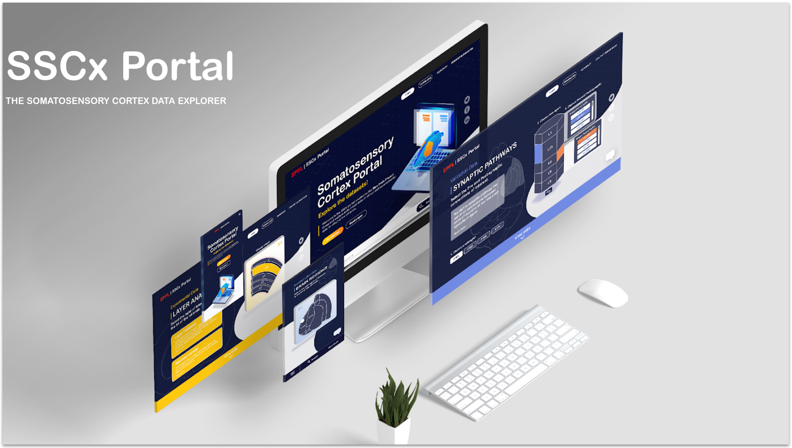

# SSCx portal

The rat brain is made up of hundreds of different regions including the Somatosensory Cortex (SSCx). This area of the cortex, which is the region of the brain associated with specific cognitive processes, receives and processes sensory information including touch, pain and temperature. It is referred to as the 'touch map' of the body.

The SSCx portal is a freely accessible resource, which provides multi-scale experimental data on the cellular, synaptic and microcircuit organization of juvenile rat primary somatosensory cortex. The portal provides a description of the extrapolation process for translating sparse experimental data into a dense tissue-level model. The portal also explores new avenues for filling the gaps in existing knowledge, as well as presenting data which has been validated against literature and the inferred hypotheses which still need validation.

The SSCx portal enables a data-driven view to build a computational model of an entire brain region, taking you through the various experimental data, resulting component models and 3D visualisations of the activity of the tissue level model.

## Experimental data

The reconstruction of the SSCx involves the acquisition and organization of data from anatomical and electrophysiological cortical slices from rodent brains. Sparse data has been collected from our own laboratory and from published sources worldwide, both of which describes the structural and functional organization of the SSCx at various anatomical levels.

This ranges from individual neurons to synaptic connections and network activity in microcircuits. The data provides constraints, rules, and the principles to build computational models at specific levels of detail.

## Reconstruction data

The SSCx workflow extracts all relevant information from sparse data and exploits interdependencies to build detailed and dense models of individual cells, synaptic connections and microcircuits. Rules and principles of organization are identified from sparse biological data sets and missing information is extrapolated to fill knowledge gaps, which enable a dense data-driven digital reconstruction of the entire SSCx region.

## Digital reconstructions

Digital reconstructions are built based on experimental datasets obtained from the developing SSCx in two-week old rats and integrate knowledge on the molecular and cellular composition of neurons, and the anatomy and physiology of synapses and microcircuits. Individually reconstructed neuron morphologies and their corresponding electrophysiological properties are assembled into atlas-based geometries of neocortical tissue to derive their synaptic connectivity.

Circuit reconstructions are based on a standardized workflow enabled by software tools and supercomputing infrastructure. The parameterization of the tissue model is based on biological data: directly, where available, generalized from data obtained in other similar systems; or, where unavailable, predicted from multi-constraints imposed by sparse data.

## Validations

Validations are a crucial part of the data-driven modeling workflow. Through validation, we reduce the risk that errors may lead to major inaccuracies in the reconstruction or in simulations of emergent behavior.

Successful validations not only enable the systematic exploration of the emergent properties of the model, but also establish predictions for future in vitro experiments, or may call into question existing experimental data.

Failure in the validation process may indicate errors in experimental data, which enables us to identify future refinements.

Rigorous validation of a metric at one level of detail therefore also prevents error amplification to the next level, and triggers specific experimental refinements.

The Blue Brain Project Validation step in our workflow provides a scaffold that enables the integration of available experimental data, identifies missing experimental data, and facilitates the iterative refinement of constituent models.

## Predictions

The digital reconstruction of the SSCx provides an array of predictions across the many levels of organization in this brain region.

These predictions provide insights to link underlying structure with function. In addition, predictions are also a means to validate the component models of the SSCx model and identify missing data that could guide targeted experiments. In particular, we provide predictions on the propagation of activity across the different sub-regions of the SSCx.


## Getting started

First, install dependencies:
```bash
npm install
```

To start the portal in development mode, run:

```bash
npm run dev
```

Open [http://localhost:3000](http://localhost:3000) with your browser to see the result.

Some of the data is generated by scripts located in the scripts folder. You can run them in order to get the latest data

## Build for production

Compile the app and export static files to the `out` folder:

```bash
npm run build && npm run export
```

## Docker image

Build a Docker image with:
```bash
docker build -t sscx-portal .
```

You can then run it with:
```bash
docker run -it --rm -p 8000:8000 sscx-portal
```

## Acknowledgment

The development of this software was supported by funding to the Blue Brain Project, a research center of the École polytechnique fédérale de Lausanne (EPFL), from the Swiss government's ETH Board of the Swiss Federal Institutes of Technology.

Copyright (c) 2024 Blue Brain Project/EPFL
